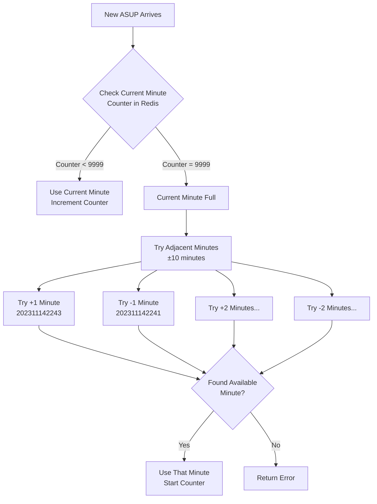

Let me explain in simple terms how the algorithm handles the >10k entries situation:

Think of it like this:

1. **Normal Case (Under 10k per minute):**

- Let's say it's 2:42 PM and an ASUP comes in
- Redis has a counter for "202311142242" (YYYYMMDDHHmm)
- If counter is at 45, it becomes "202311142242**0045**"
- Counter increases by 1 for each new ASUP

2. **When 10k Limit is Hit:**
   Let me draw this scenario:



Here's what happens step by step:

1. An ASUP comes in at 2:42 PM
2. System checks Redis counter for 2:42
3. If counter shows 9999 (full):
   - Try 2:43 PM (is it under 9999?)
   - If full, try 2:41 PM
   - Keep trying up to 10 minutes forward and backward
4. As soon as it finds a minute with space (counter < 9999):
   - Uses that minute in the ID
   - Starts incrementing that minute's counter

Example:

```
Let's say ASUPs arrive at exactly 2:42:00 PM:

First 9999 ASUPs:   202311142242[0001 through 9999]
Next few thousand:  202311142243[0001 through xxxx]  (using next minute)
More ASUPs:         202311142241[0001 through xxxx]  (using previous minute)
```

The Redis part:

```python
# Simplified version of what happens in Redis:

minute_2_42 = "counter:202311142242"
minute_2_43 = "counter:202311142243"

# When 2:42 is full (reaches 9999):
redis.get("counter:202311142242")  # Returns 9999
# Try 2:43
redis.get("counter:202311142243")  # Returns current count or nothing if unused
```

Important points:

1. Redis just keeps a running counter for each minute
2. Counters automatically delete after 24 hours to clean up
3. If all minutes (±10) are full, it returns an error
4. All this happens very fast (milliseconds) because Redis is in-memory

The system is basically like having 21 buckets (current minute ±10 minutes) that can each hold 9999 items. When one bucket fills up, it tries the next available bucket.

This means your total capacity per minute is actually:

- Minimum: 9,999 (if you need strict time ordering)
- Maximum: 209,979 (if you can use ±10 minutes: 21 minutes × 9,999)

Does this explanation help clarify how the system handles overflow situations?
