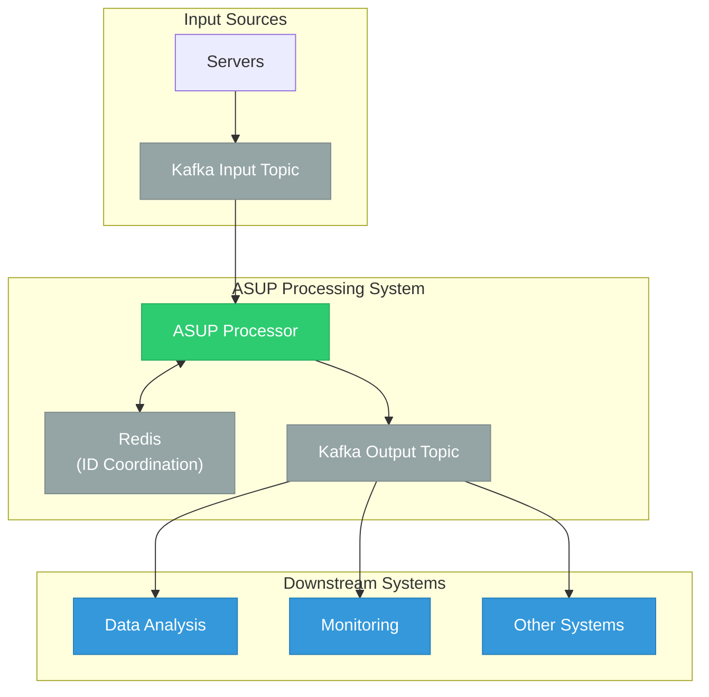
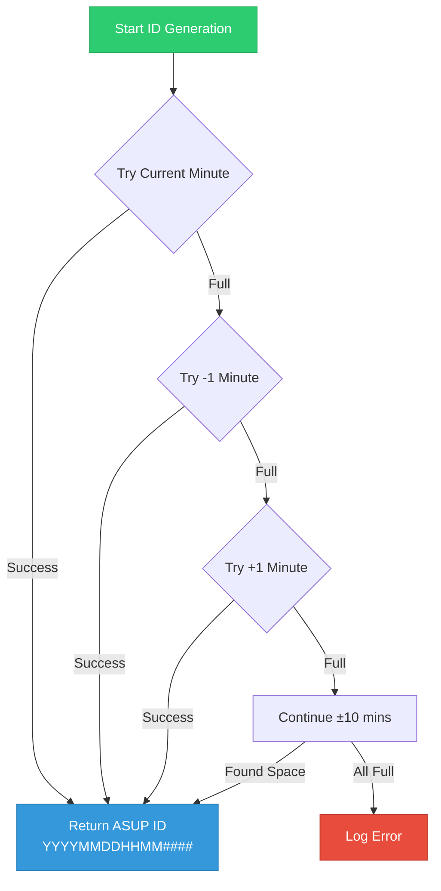
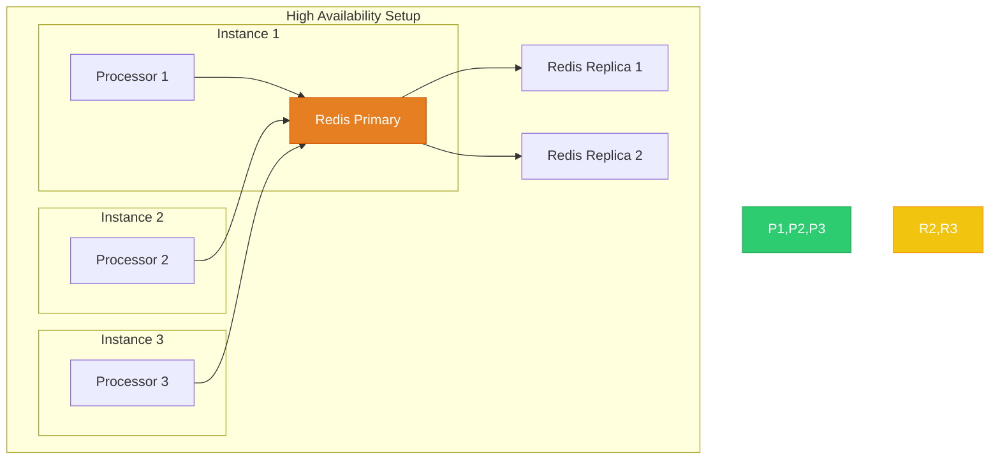
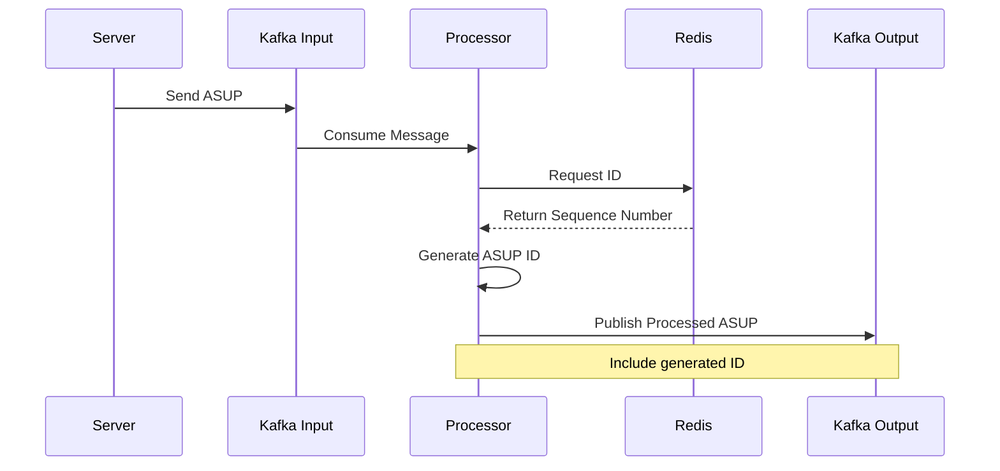
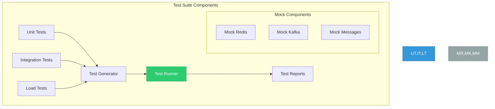
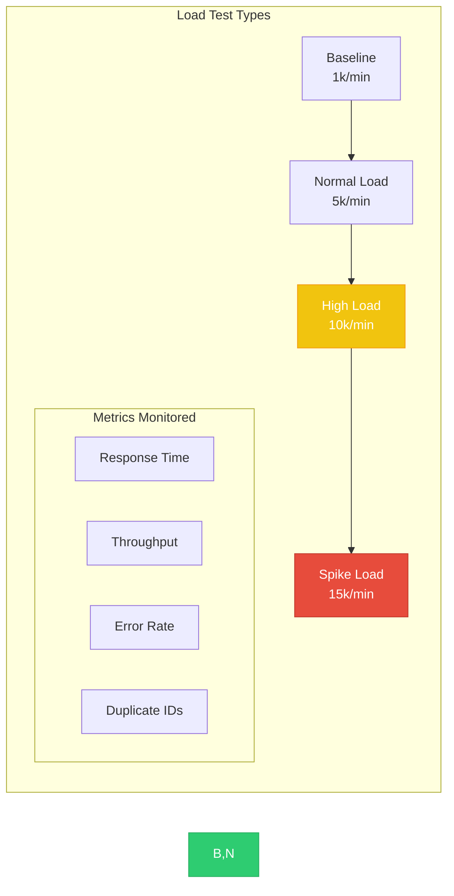
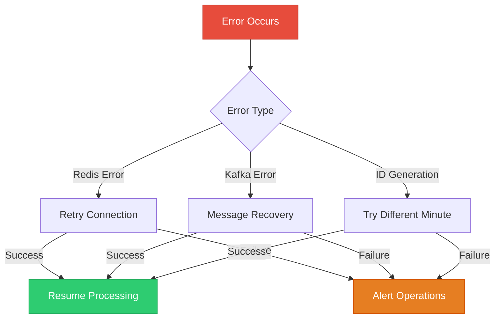
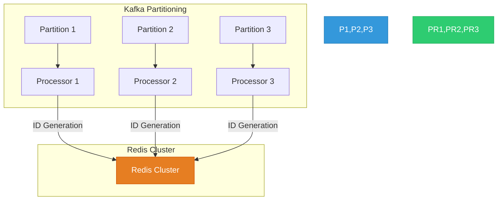

# ASUP Processing System Documentation

## 1. High-Level System Overview

## 2. ASUP ID Generation Process

## 3. Redundancy and Fault Tolerance

## 4. Message Processing Flow

## 5. Testing Architecture

## 6. Load Testing Scenarios

## 7. Error Handling Flow

## 8. Scaling Strategy

## Key Features Explained

1. **ID Generation**:

   - First 12 digits: YYYYMMDDHHMM (timestamp)
   - Last 4 digits: Sequential number (0000-9999)
   - Flexible minute allocation (±10 minutes)

2. **Fault Tolerance**:

   - Multiple processor instances
   - Redis replication
   - Kafka partition redundancy
   - Automatic error recovery

3. **Load Handling**:

   - Supports >10k ASUPs per minute
   - Distributes load across minutes
   - Multiple processing instances
   - Kafka partitioning

4. **Testing Coverage**:
   - Unit tests for components
   - Integration tests for workflow
   - Load tests for performance
   - Mock components for isolation
