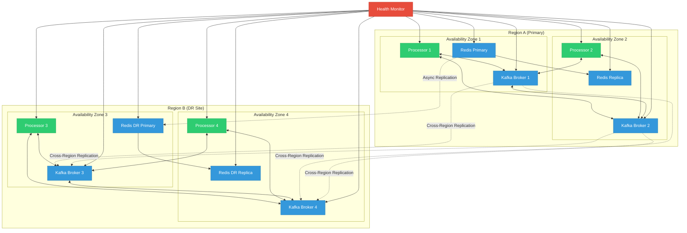
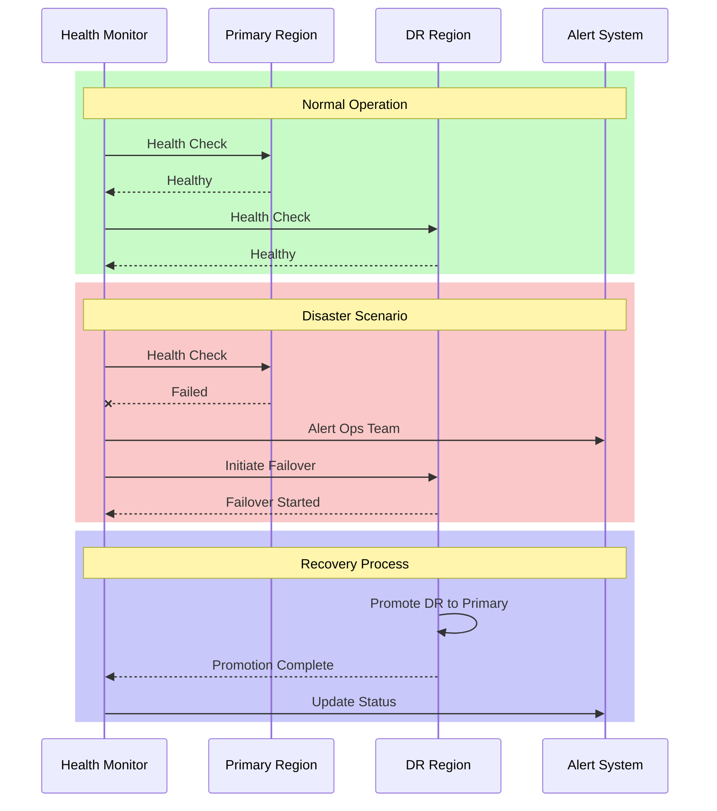
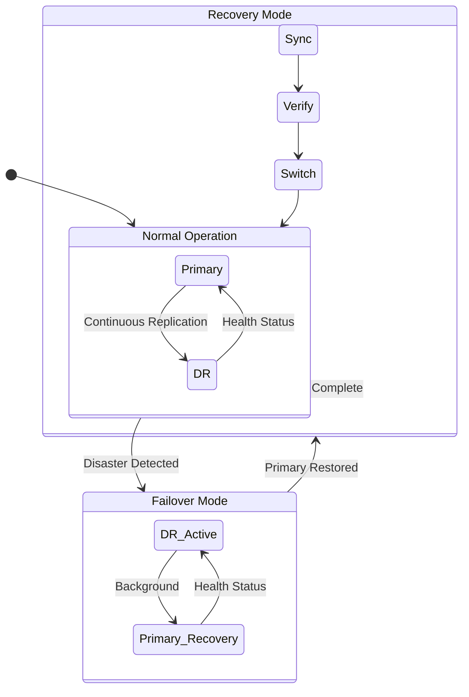

```mermaid
graph TB
    subgraph "Region A (Primary)"
        subgraph "Availability Zone 1"
            P1[Processor 1]
            K1[Kafka Broker 1]
            R1[Redis Primary]
        end

        subgraph "Availability Zone 2"
            P2[Processor 2]
            K2[Kafka Broker 2]
            R2[Redis Replica]
        end
    end

    subgraph "Region B (DR Site)"
        subgraph "Availability Zone 3"
            P3[Processor 3]
            K3[Kafka Broker 3]
            R3[Redis DR Primary]
        end

        subgraph "Availability Zone 4"
            P4[Processor 4]
            K4[Kafka Broker 4]
            R4[Redis DR Replica]
        end
    end

    %% Connections between components
    P1 & P2 <--> K1 & K2
    P3 & P4 <--> K3 & K4

    K1 <--> K2
    K3 <--> K4
    K1 & K2 -.->|Cross-Region Replication| K3 & K4

    R1 --> R2
    R3 --> R4
    R1 -.->|Async Replication| R3

    %% Health Monitoring
    HM[Health Monitor] --> P1 & P2 & P3 & P4
    HM --> K1 & K2 & K3 & K4
    HM --> R1 & R2 & R3 & R4

    classDef primary fill:#2ecc71,stroke:#27ae60,color:white
    classDef secondary fill:#3498db,stroke:#2980b9,color:white
    classDef monitor fill:#e74c3c,stroke:#c0392b,color:white

    class P1,P2,P3,P4 primary
    class K1,K2,K3,K4,R1,R2,R3,R4 secondary
    class HM monitor
```

```mermaid
sequenceDiagram
    participant HM as Health Monitor
    participant P as Primary Region
    participant DR as DR Region
    participant Alert as Alert System

    rect rgb(200, 250, 200)
        Note over HM,Alert: Normal Operation
        HM->>P: Health Check
        P-->>HM: Healthy
        HM->>DR: Health Check
        DR-->>HM: Healthy
    end

    rect rgb(250, 200, 200)
        Note over HM,Alert: Disaster Scenario
        HM->>P: Health Check
        P--xHM: Failed
        HM->>Alert: Alert Ops Team
        HM->>DR: Initiate Failover
        DR-->>HM: Failover Started
    end

    rect rgb(200, 200, 250)
        Note over HM,Alert: Recovery Process
        DR->>DR: Promote DR to Primary
        DR-->>HM: Promotion Complete
        HM->>Alert: Update Status
    end
```

```mermaid
stateDiagram-v2
    [*] --> Normal

    state "Normal Operation" as Normal {
        Primary --> DR: Continuous Replication
        DR --> Primary: Health Status
    }

    state "Failover Mode" as Failover {
        DR_Active --> Primary_Recovery: Background
        Primary_Recovery --> DR_Active: Health Status
    }

    state "Recovery Mode" as Recovery {
        Sync --> Verify
        Verify --> Switch
        Switch --> Normal
    }

    Normal --> Failover: Disaster Detected
    Failover --> Recovery: Primary Restored
    Recovery --> Normal: Recovery Complete
```
